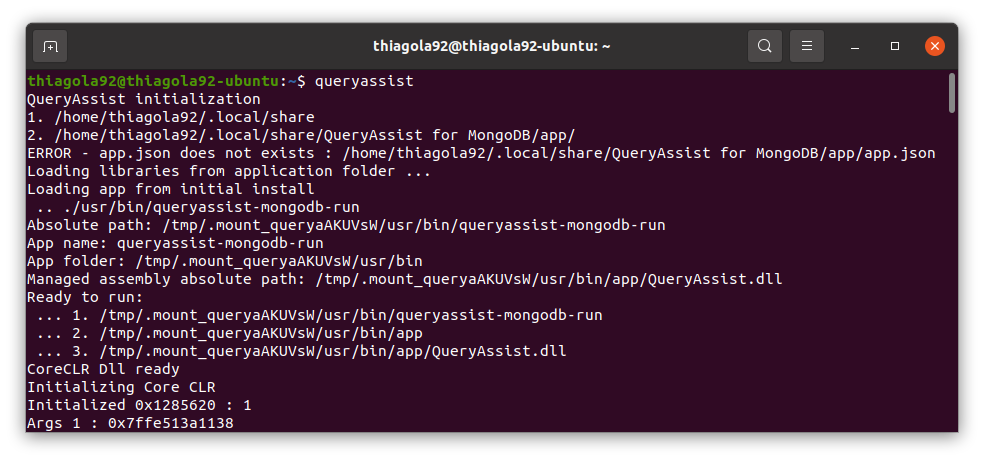

# QueryAssist Installer
Download and setup QueryAssist on Ubuntu.  

# Install
On terminal, execute the following commands:  
```shell
$ git clone https://github.com/thiagola92/queryassist-installer.git
$ cd queryassist-installer
$ bash install.sh
$ cd ..
$ rm -rf queryassist-installer
```  

# Images

## Appears on search
  

## Initialize by Terminal
  
